# DIO - Trilha .NET - Fundamentos -> Banco de Dados

## Contexto
Eu fui contratado para ser o responsável pelo banco de dados de um site de filmes, onde são armazenados dados sobre os filmes e seus atores. Sendo assim, foi solicitado para que eu realizasse consultas no banco de dados com o objetivo de trazer alguns dados para análises.

## Proposta
Fora solicitadas 12 consultas ao banco de dados, cada uma retornando um tipo de informação.
O meu banco de dados está modelado conforme abaixo:

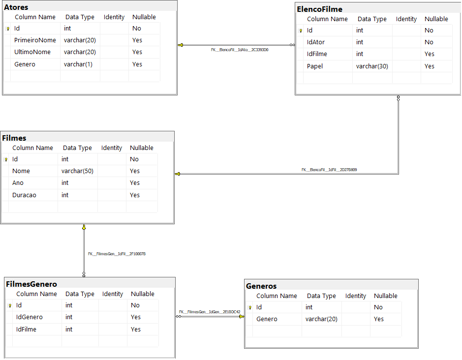

As tabelas são descritas conforme a seguir:

**Filmes**

Tabela responsável por armazenar informações dos filmes.

**Atores**

Tabela responsável por armazenar informações dos atores.

**Generos**

Tabela responsável por armazenar os gêneros dos filmes.

**ElencoFilme**

Tabela responsável por representar um relacionamento do tipo muitos para muitos entre filmes e atores, ou seja, um ator pode trabalhar em muitos filmes, e filmes
podem ter muitos atores.

**FilmesGenero**

Tabela responsável por representar um relacionamento do tipo muitos para muitos entre filmes e gêneros, ou seja, um filme pode ter mais de um gênero, e um genêro pode fazer parte de muitos filmes.

## Preparando o banco de dados
Para a realização deste desafio, foi necessário executar o arquivo **ScriptFilmes.sql** em meu banco de dados SQL Server, presente na pasta Scripts deste repositório ([ou clique aqui](/Scripts/Filmes.sql)), que foi disponibilizado pela equipe da DIO no seguinte repositório [Git Hub](https://github.com/digitalinnovationone/trilha-net-banco-de-dados-desafio). Esse script irá criar um banco chamado **Filmes**, contendo as tabelas e os dados necessários para realizar este desafio.

## Objetivo
Criar diversas consultas, com o objetivo de retornar os dados a seguir. Abaixo de cada pedido tem o retorno esperado e no arquivo [RespostasDesafio.sql](/Scripts/RespostasDesafio.sql) possui os **Scripts** para as respostas referentes a estas imagens.

## 1 - Buscar o nome e ano dos filmes

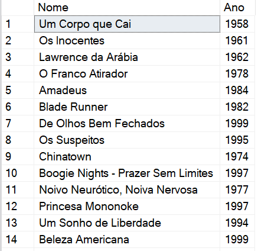

## 2 - Buscar o nome e ano dos filmes, ordenados por ordem crescente pelo ano

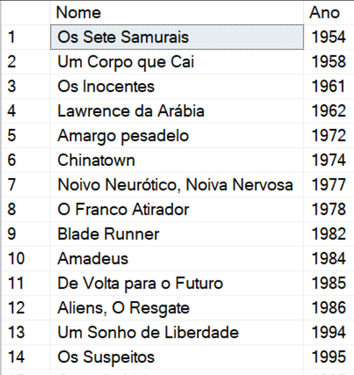

## 3 - Buscar pelo filme *De Volta para o Futuro*, trazendo o nome, ano e a duração

## 4 - Buscar os filmes lançados em 1997

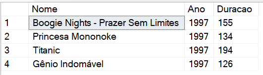

## 5 - Buscar os filmes lançados APÓS o ano 2000

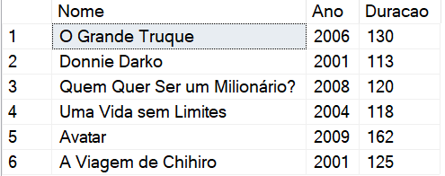

## 6 - Buscar os filmes com a duração maior que 100 e menor que 150, ordenando pela duração em ordem crescente

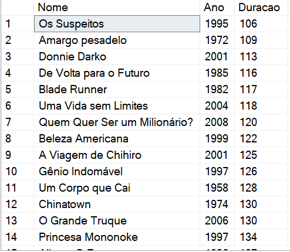

## 7 - Buscar a quantidade de filmes lançadas no ano, agrupando por ano, em ordem decrescente

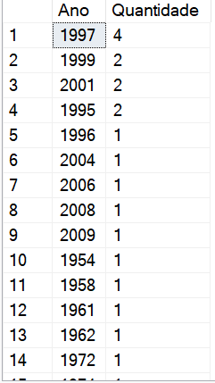

## 8 - Buscar os Atores do gênero masculino, retornando o PrimeiroNome, UltimoNome

## 9 - Buscar os Atores do gênero feminino, retornando o PrimeiroNome, UltimoNome, e ordenando pelo PrimeiroNome

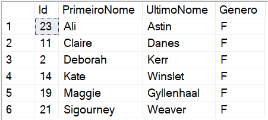

## 10 - Buscar o nome do filme e o gênero

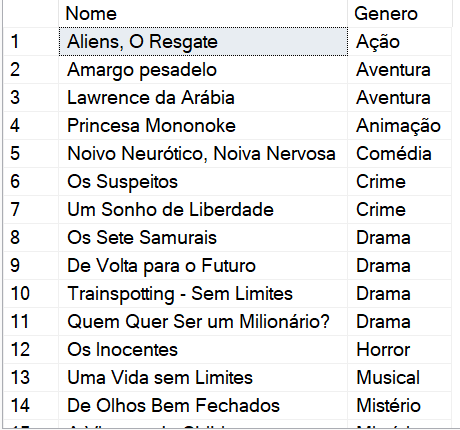

## 11 - Buscar o nome do filme e o gênero do tipo "Mistério"

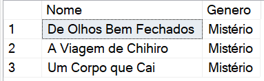

## 12 - Buscar o nome do filme e os atores, trazendo o PrimeiroNome, UltimoNome e seu Papel

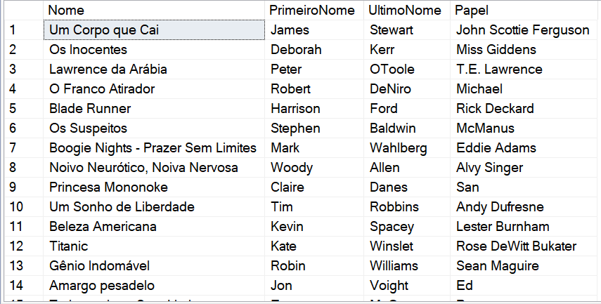
